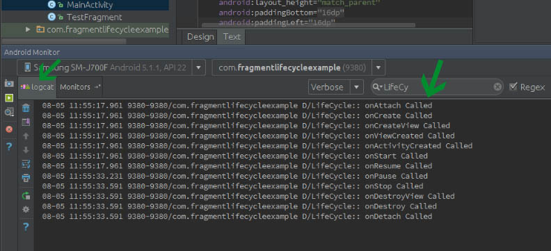

# FragmentLifecycle
In Android, Fragment is a part of an activity which enable more modular activity design. 
It will not be wrong if we say a fragment is a kind of sub-activity.
It represents a behavior or a portion of user interface in an Activity. 
We can combine multiple Fragments in single Activity to build a multi pane UI and reuse a Fragment in multiple Activities. 
A fragment must always be embedded in an activity and the fragment’s life-cycle is directly affected by the host activity’s life-cycle.

#### see final output and step by step explanation

